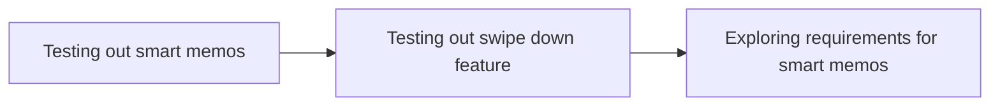
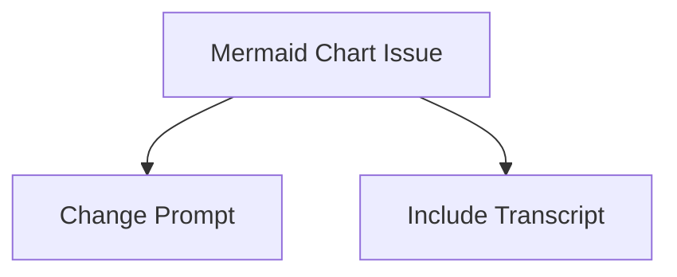
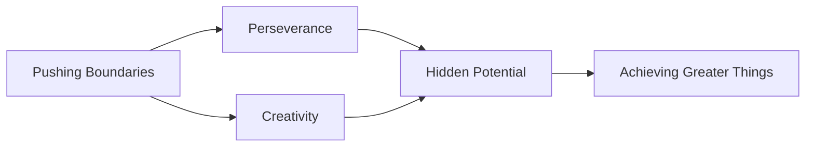

```calendar-nav
```

# Dailies

- [x] Workout
- [x] Inner Work
- [x] AI
- [x] Entrepreneurship
- [x] Socialization
- [x] Meditation
- [x] Walk
- [x] Twitter
- [x] Breathwork
- [x] Second Brain

# Misc

![[smartmemos/recording-1721992548161.wav]]

- Testing out smart memos
- Testing out swipe down feature
- Exploring requirements for smart memos
Smart memos are a feature being tested, specifically the swipe down function to see what is needed for its implementation.
---
In this conversation, the individual is experimenting with smart memos and the swipe down feature to understand its functionality and requirements. 


# Transcript
I'm testing out smart memos. I'm testing out the swipe down. I want to see what is required.

# [[Data Modeling]]


# Coaching/Consulting

It's about [[emotion]].

Health fitness wellness

Mind 
Body
Sprit 


# [[Twitter Posts]]

[[Religion]] claims "I know". This is how things are. I know the [[truth]]. Don't question me.

Science claims I do not know, let's find out. I do not know the [[truth]], but I'm willing to work for it.

Feeling good and being right are often at odds with each other.

One feels good and the other solves real world problems.

/

[[Religion]]: "This is how things are. If you don't stop asking questions, I may have to kill you."

Science: "I do not know the [[truth]], but I'm willing to work for it, even if I never get  there."

Ultimately, feeling good and being right are often at odds with each other.

/ 

Machiavelli enters the chat.

![[smartmemos/recording-1722028112305.wav]]
# Exploring Smart Memos with New Prompts
## Testing Smart Memos Functionality
- Individual is testing out Smart Memos after changing the prompt
- Curious to see the results of the new prompt
## Summary
The individual is experimenting with Smart Memos again after modifying the prompt to see how it affects the functionality.


![[smartmemos/recording-1722028231558.wav]]
# Making the Mermaid Chart Work
## Attempting to fix the issue with the mermaid chart not working
The mermaid chart did not work this time, but the prompt was changed to see if that would resolve the issue.
### Raw Transcript
"Let's try this again. The mermaid chart didn't work this time, but I changed my prompt. I also want to see whether I can include the transcript within the prompt."
## Summary
The speaker is attempting to fix an issue with the mermaid chart not working by changing the prompt and seeing if including the transcript within the prompt helps.



![[smartmemos/recording-1722028348352.wav]]
# Unleashing Hidden Potential through Growing Roses from Concrete
## Key Points:
- Metaphor of growing roses from concrete signifies finding hidden potential in unlikely places
- Emphasizes the importance of perseverance and creativity in achieving greater things
- Relates to the concept of pushing boundaries and thinking outside the box
## Raw Transcript:
Growing Roses from Concrete, The Hidden Potential, The Science of Achieving Greater Things, New [[Obsidian]] Plugins You Need to Check Out, by Prakash Joshi Fox



![[smartmemos/recording-1722028776825.wav]]
# Improving Prompt Understanding
## Summary
The speaker is discussing the issues they faced with a previous prompt, including addressing context understanding, Markdown formatting, and creating a successful Mermaid chart.
## Additional Information
- Understanding the context of a prompt is crucial for providing accurate and relevant notes.
- Proper Markdown formatting helps in organizing and presenting information clearly.
- Creating a successful Mermaid chart requires a clear understanding of the [[relationships]] between different concepts.
## Mermaid Chart
```mermaid
graph TD;
    A[Understanding Context] --> B[Accurate Notes];
    A --> C[Relevant Information];
    A --> D[Clear Presentation];
    A --> E[Proper Formatting];
    A --> F[Mermaid Chart [[Success]]];
``` 
## Raw Transcript
Let's see how this prompt is supposed to work. There are issues to address, clarity and specificity. It had a problem with context understanding, Markdown formatting, and mermaid chart instructions, which failed last time. Let's see how it does.

# [[Jupiter]] James


//

“Our deepest [[fear]] is not that we are inadequate. Our deepest fear is that we are powerful beyond measure. It is our light, not our darkness that most frightens us. We ask ourselves, 'Who am I to be brilliant, gorgeous, talented, fabulous?' Actually, who are you not to be? You are a child of [[God]]. Your playing small does not serve the world. There is nothing enlightened about shrinking so that other people won't feel insecure around you. We are all meant to shine, as children do. We were born to make manifest the glory of God that is within us. It's not just in some of us; it's in everyone. And as we let our own light shine, we unconsciously give other people permission to do the same. As we are liberated from our own fear, our presence automatically liberates others.” ― Marianne Williamson